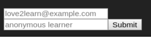

## This is in Alpha development!

## TLDR; Download the demo and send statements

[demo](https://github.com/garajo/reveal.js-xapi-plugin/raw/master/dist/demo.zip)

## Features

- Bring HTML and xAPI capabilities to Instructional/Course Designers
- HTML-based statement builder
- as plugin, leverages established client-side slide navigator, [RevealJS](http://lab.hakim.se/reveal-js/) by [Hakim el Hattab](http://hakim.se), and augments it with support for xapi
- exploration of profile data within client context
- a xAPI statement sender
- consistent Activity IDs, yet override-able, based on slide indexes
- define your Activity name and description
- embed videos, audio, custom components such as quizzes with capability to send statements

## How to use

### About RevealJS

RevealJS is a [HTML Presentation Framework](https://revealjs.com).

### Plugin Configurations

Refer to RevealJS plugin [configurations](https://github.com/hakimel/reveal.js/#configuration)

xAPI plugin config is defined as the `xapi` property

```js

```

#### Properties

__version__
```
object: {
  "id": "http://localhost:8084#/0/0:0.0.1",
```

__dev_mode__ [false]

Setting this to `true` sets:
- _send_enabled_ to `true`
- _statement_helper_ to `false`
- _debug_ (console) to `false`
-
__send_enabled__ [false]

Send statements.

__statement_helper__ [false]

Statement Helper UI component is visible at startup.

__getActorOnInit__ [false]

Displays an forms to get actor email and name at slide start.



__lang_ISO__ ['en']

__local_ISO__ ['US']

__profiles__

The authored profiles data to load into the statement helper and to use when checking built statements. From https://github.com/adlnet/xapi-authored-profiles

__authority__

The authority property of xapi statements

### How to build and send statements

The primary way statements are sent are through HTML attributes, specifically the [data attributes](https://developer.mozilla.org/en-US/docs/Learn/HTML/Howto/Use_data_attributes).

| Attribute                   | Description |
| :---------------------------| :---------- |
| data-xapi                   | dot separated `verb` + `activity`
| data-name                   | `name` property of the statement Activity
| data-decription             | `description` property of the statement Activity

```html
<section
  data-xapi="advanced.slide"
  data-name="Introductory slide/activity"
  data-description="The slide that introduced how to build statements"
>
</section>
```

A key-value set of functions can be defined too, as a property of 'statement'. Functions are triggered by setting their `key` value as the `data-xapi` attribute for `section` and `#fragment`. When a slide or fragment gets consumed, the function gets called.

```html
<section data-xapi="staticFn" >
  <h4>Sending statement from a function call</h4>
</section>

<script>
staticFn: () => {
  return 'advanced.slide'
}
</script>
```

If you need to trigger more than one statement, send an array of dot `'verb.activity'`, as so

```js
staticFn: () => {
  return ['attended.lesson', 'advanced.slide']
}

```

Statement functions are also great for custom logic, and to build and send statements for their embedded content, like video statements.

Before statements are sent, they are validated against the loaded `profiles`. The `debug`/`console` will give more information for statements that have issues.

## How to set up the development environment

You will need to install `node`, `npm`, and `git`. Refer to the many instructions on the web for your operating system.

Installing this repository in your local environment adds the following
- Install a distribution copy of the default RevealJS presentation at the root level
- Serves your presentation, while developing the plugin. Run `npm start`
- The browser reloads as you develop and save edited files, including the HTML presentations
- Customize your plugin

```bash
git clone https://github.com/garajo/reveal.js-xapi-plugin
cd reveal.js-xapi-plugin
npm i
```

## Feedback and Pull Requests welcome

## <a name="roadmap"></a>Roadmap

- get feedback from users, Instructional/Course Designers
  - what features would be needed for richer use
- get feedback from technical reviewers
  - any incorrect implementations
  - other statement parts that can be included

## Limitations
- default as client side application, it is inherently insecure
- can be used for temporal data gathering from learners, such as MOOCs
- patching with tokens, or other techniques; it can be securely served

## Vantages of HTML Standards for Instructional Design and Ed Tech Development

The variety of content and media that can be embedded into HTML, and defining content behaviour and interactions are endless. Therefore HTML is perhaps the best canvas to build rich, instructional content.

The open standards of HTML, JS, and CSS are strong guarantees to device-content compatibility(?arguable), and consumable by browsers, native applications, and mobile devices.

You can open `revealJS/index.html` in a browser, and send statements.


### Need help
- See [RoadMap](#roadmap)
- Models
- Preact/AVA integration
